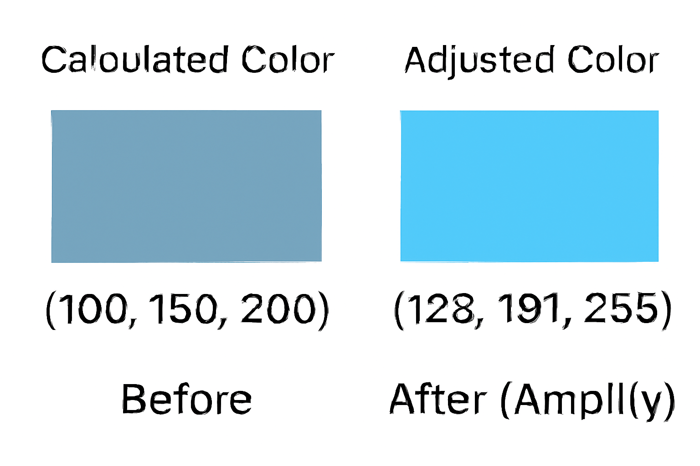

# fork from  
Это fork репозитария Алексея
https://github.com/AlekPet/ComfyUI_Custom_Nodes_AlekPet
 
# fork from

Это fork chflame163
https://github.com/chflame163/ComfyUI_LayerStyle

Собственно сам репозиторий является компактной сборкой с небольшой модификацией кода.

## Переводчик Google

Данные ноды только переводят с помощью Google translate.

Никакого ключа создавать не требуется

GoogleTranslateCLIPTextEncodeNode

GoogleTranslateTextNode

## Image resize

Представлена ровно одна нода которая позволяет делать resize картинки и/или маски

Маску можно не указывать - тогда будет обычный resize (или upscale)

Для upscale желательно использовать другую ноду.

ImageScaleByAspectRatioV2

## Слайдер Float

Float slider

Замена для 
https://github.com/11dogzi/Comfyui-ergouzi-Nodes


## хеш последнего комита
git ls-remote https://github.com/gayratv/ComfyUI_Gayrat HEAD


## Вычисление процентного соотношения площади маски к общей площади изображения

fork from https://github.com/a-und-b/ComfyUI_MaskAreaCondition

## добавлена нода SaveImageWithMask

fork from
https://github.com/MinorBoy/ComfyUI_essentials_mb

## Color Correction
fork from
https://github.com/melMass/comfy_mtb/blob/7e89e96e9d83d7753a64a528df0828eb82a5f20d/nodes/image_processing.py#L432

## Concat Images
конкатенирует от 2 до 4 изображений в одно для Flux Kontext
колор принимает от Color Input (RMBG)

## SaveImageJPG
Нода для сохранения изображений в формате JPG с регулировкой качества.
Нужна для Flux Kontext чтобы не превысить лимит 
Из png в 5200кб делает jpg 672кб

## latent с размерами FluxSDLatentImage

fork from
https://github.com/GavChap/ComfyUI-SD3LatentSelectRes

### Документация узла FluxSDLatentImage

#### Обзор

FluxSDLatentImage — это пользовательский узел для ComfyUI, предназначенный для создания пустых латентных изображений для моделей Flux, SD (Stable Diffusion) и SDXL. Узел обеспечивает правильную инициализацию и полную поддержку соотношений сторон с предустановленными оптимальными разрешениями для каждого типа модели.

#### Возможности

- **Поддержка нескольких моделей**: Работает с SD 1.5, SDXL и Flux
- **Оптимизированные пресеты**: Предустановленные разрешения, оптимизированные для каждой модели
- **Поддержка соотношений сторон**: 5 распространённых соотношений (1:1, 4:3, 3:4, 16:9, 9:16)
- **Умная инициализация**: Различные методы инициализации для разных моделей
- **Оптимизация памяти**: По умолчанию 896x896 для Flux для экономии памяти
- **Управление seed**: Расширенное управление seed с несколькими режимами

#### Параметры узла

##### Входные параметры

| Параметр | Тип | Описание | По умолчанию |
|----------|-----|----------|--------------|
| **model** | COMBO | Выбор типа модели: SD, SDXL или Flux | - |
| **aspect_ratio** | COMBO | Соотношение сторон: 1:1, 4:3, 3:4, 16:9, 9:16 | - |
| **size** | COMBO | Разрешение (динамически обновляется в зависимости от модели и соотношения) | 896x896 (Flux) |
| **batch_size** | INT | Количество латентных изображений для генерации | 1 |
| **seed** | INT | Случайное зерно для генерации | 0 |
| **control_after_generate** | COMBO | Поведение seed после генерации (опционально) | randomize |


#### Спецификации моделей

##### SD (Stable Diffusion 1.5)
- **Каналы**: 4
- **Инициализация**: Константа (0.0609)
- **Тип данных**: float32
- **Оптимальный размер**: 512x512

##### SDXL
- **Каналы**: 4
- **Инициализация**: Константа (0.0609)
- **Тип данных**: float32
- **Оптимальный размер**: 1024x1024

##### Flux
- **Каналы**: 16
- **Инициализация**: Случайный шум
- **Тип данных**: float16
- **Оптимальный размер**: 896x896 (оптимизировано по памяти)

#### Поддерживаемые разрешения

##### Разрешения SD
```
1:1  → 512x512, 640x640, 768x768
4:3  → 512x384, 640x480, 768x576
3:4  → 384x512, 480x640, 576x768
16:9 → 512x288, 640x360, 768x432, 896x512
9:16 → 288x512, 360x640, 432x768, 512x896
```

##### Разрешения SDXL
```
1:1  → 768x768, 896x896, 1024x1024, 1152x1152
4:3  → 768x576, 896x672, 1024x768, 1152x864
3:4  → 576x768, 672x896, 768x1024, 864x1152
16:9 → 768x432, 896x512, 1024x576, 1152x640, 1280x720
9:16 → 432x768, 512x896, 576x1024, 640x1152, 720x1280
```

##### Разрешения Flux
```
1:1  → 896x896, 1024x1024, 1152x1152, 1280x1280, 1408x1408
4:3  → 896x672, 1024x768, 1152x864, 1280x960, 1408x1056
3:4  → 672x896, 768x1024, 864x1152, 960x1280, 1056x1408
16:9 → 896x512, 1024x576, 1152x640, 1280x720, 1408x800, 1536x864, 1920x1088
9:16 → 512x896, 576x1024, 640x1152, 720x1280, 800x1408, 864x1536, 1088x1920
```


#### Технические детали

##### Оптимизация памяти
Для моделей Flux рекомендуемое разрешение — 896x896, так как оно обеспечивает хороший баланс между качеством и использованием памяти. Узел использует точность float16 для Flux для дополнительного снижения потребления памяти.


## Pixtral Large — multimodal node for Mistral

| **Категория** | `Gayrat/Pixtral Large` |
| ------------- | ---------------------- |

Pixtral Large — это узел ComfyUI, позволяющий применять полностью мультимодальную модель **`pixtral-large-latest`** от Mistral для анализа изображений и/или генерации текста.

### Ключевые возможности

* Принимает **один** или **ноль** изображений. Если изображение не передано, узел работает как обычный текстовый LLM‑чат.
* Не блокирует граф: запросы выполняются асинхронно с помощью `httpx` + `asyncio`.
* Два выхода:

  1. **`response_original`** — оригинальный ответ модели (на том же языке, что и prompt).
  2. **`response_en`** — тот же текст, автоматически переведённый на английский.
* Поддержка nucleus‑sampling через параметр **`top_p`** (по умолчанию `0.85` — оптимально для описания изображений).
* Ключ Mistral берётся из переменной окружения **`MISTRAL_API_KEY`** — никаких полей `api_key` в UI.

### Параметры узла

| Имя             | Тип    | Обязателен | По умолчанию | Описание                                                                                                |
| --------------- | ------ | ---------- | ------------ | ------------------------------------------------------------------------------------------------------- |
| **prompt**      | STRING | ✔          | —            | Текст запроса к модели.                                                                                 |
| **temperature** | FLOAT  | ✔          | `0.7`        | Контролирует креативность модели.                                                                       |
| **top\_p**      | FLOAT  | ✔          | `0.85`       | Сколько «массы вероятности» рассматривать (0.6–0.8 фактологично, 0.85 сбалансировано, 0.95+ креативно). |
| **image**       | IMAGE  | ✖          | —            | Изображение для анализа. Если не указано — будет чисто текстовый диалог.                                |

### Выходы

| Имя                    | Тип    | Описание                          |
| ---------------------- | ------ | --------------------------------- |
| **response\_original** | STRING | Оригинальный ответ Pixtral Large. |
| **response\_en**       | STRING | Перевод ответа на английский.     |

### Минимальный пример графа

```
(Text box) → Pixtral Large → (Text box)
                            ↘︎→ (Text box) [перевод]
```

1. В параметре **prompt** введите запрос (можно на любом языке).
2. При необходимости подключите изображение к порту **image**.
3. На выходе получите `response_original` и `response_en`.

### Требования

```bash
pip install httpx pillow torch
export MISTRAL_API_KEY="<ваш‑ключ>"
```

### Советы по использованию

* Если модель «галлюцинирует», уменьшите `top_p` до `0.75`.
* Для максимально фактического вывода также можно снизить `temperature` до `0.4`.
* Не передавайте изображения крупнее 8 МБ — узел сам сожмёт картинку до JPEG 85 %, но лимит у Mistral остаётся.

## Pixtral Translate EN — текстовый переводчик на английский

| **Категория** | `Gayrat/Pixtral Large` |
| ------------- | ---------------------- |

Pixtral Translate EN — это вспомогательный узел ComfyUI, выполняющий точный перевод любого текста на английский язык при помощи той же модели **`pixtral‑large‑latest`**.

### Ключевые возможности

* Принимает **только текст**: никаких изображений, чисто LLM‑режим.
* Системный промпт гарантирует «немой» режим переводчика — на выходе только перевод, без комментариев.
* Параметр **temperature** позволяет выбирать баланс «дословно/вольный», по умолчанию 0.3.
* Идеально компонуется после русскоязычных нод или перед SDXL‑prompt.

### Параметры узла

| Имя             | Тип    | Обязателен | По умолчанию | Описание                   |
| --------------- | ------ | ---------- | ------------ | -------------------------- |
| **text**        | STRING | ✔          | —            | Текст для перевода.        |
| **temperature** | FLOAT  | ✖          | `0.3`        | Температура семплирования. |

### Выходы

| Имя                | Тип    | Описание                                |
| ------------------ | ------ | --------------------------------------- |
| **translated\_en** | STRING | Переведённый текст (только английский). |

### Минимальный пример графа

```
(Text box) → Pixtral Translate EN → (Text box)
```

### Требования

Те же, что и у `Pixtral Large`: переменная `MISTRAL_API_KEY` и библиотека `httpx`.


### 4. Набор нод для тестирования разнообразных параметров генерации для модели Flux

#### Данные ноды работают только для модели **Flux**. Это могут быть обычные модели, gguf, nf4, nunchaku. Для других моделей необходима **корректировка** кода.

В ряде случаев хочется узнать какой sampler/scheduler применить, какое минимальное количество шагов можно поставить для генерации. Для этих целей предназначен данный набор нод.

Набор состоит из следующих нод:

* Sampler Select Helper

* Scheduler Select Helper

* Flux Sampler Params
 
* SdxlSamplerParams (Gayrat)

* 🔧 Plot Sampler Parameters

#### Sampler Select Helper
* Отображает список имеющихся sampler в системе. Вы можете собрать набор интересующих Вас семплеров.
#### Scheduler Select Helper
* Отображает список имеющихся Scheduler в системе. Дополнительно выведен новый OptimalStepsSchaeduler который Вы тоже можете выбирать и использовать.

#### Flux Sampler Params
* нода заменяет собой Ksampler на вход принимает названия Samplers, Schedulers из вспомогательных нод, описанных ранее.
* **seed**
    * Вы можете задавать следующие значения:
    * ? - генеририуется и фиксируется рандомный seed
    * можно задать несколько seed через запятую, например 10, 20, 30. В таком случае будет запущено три генерации с указанными seed

#### SdxlSamplerParams (Gayrat)
* то же что и Flux Sampler Params но для моделей SDXL и SD1.5
* пример workflow - SDXL sampler params.png

#### 🔧 Plot Sampler Parameters
* рисует заданные параметры на выходном изображении

#### Пример workflow приведен в test2.png


Вот как можно оформить добавление к твоему README, включая описание и картинку для ноды **YANCGetMeanColor**:

---

## YANCGetMeanColor

| **Категория** | `Gayrat/images` |
| ------------- | --------------- |

**YANCGetMeanColor** — нода для вычисления среднего цвета изображения с возможностью учитывать маску и усиливать цвет.

fork from
https://github.com/ALatentPlace/ComfyUI_yanc

Полностью нода у меня не запустилась, вырезал один узел

### Ключевые возможности

* **Вычисление среднего цвета** изображения или выбранной области (по маске).
* Поддержка как полного изображения, так и отдельных фрагментов.
* Возможность **усиления цвета** (`amplify=True`) — самая яркая компонентa RGB доводится до максимума (255), остальные увеличиваются пропорционально, чтобы сохранить оттенок.

### Параметры узла

| Имя           | Тип     | Обязателен | По умолчанию | Описание                                                                    |
| ------------- | ------- | ---------- | ------------ | --------------------------------------------------------------------------- |
| **image**     | IMAGE   | ✔          | —            | Входное изображение.                                                        |
| **amplify**   | BOOLEAN | ✔          | `False`      | Усилить яркость цвета, сохранив оттенок.                                    |
| **mask\_opt** | MASK    | ✖          | —            | Необязательная маска для выбора области, по которой вычислять средний цвет. |

### Выходы

| Имя       | Тип    | Описание                             |
| --------- | ------ | ------------------------------------ |
| **int**   | INT    | Целое RGB-значение (0xRRGGBB).       |
| **red**   | INT    | Компонента красного (0–255).         |
| **green** | INT    | Компонента зелёного (0–255).         |
| **blue**  | INT    | Компонента синего (0–255).           |
| **hex**   | STRING | HEX-представление цвета (`#RRGGBB`). |

### Пример работы `amplify`



Пример
Средний цвет до усиления:

R = 100 G = 150 B = 200

Максимум = 200 (синий канал)
Разница до предела (255) = 55

Пропорциональное усиление:

R: 100 + 55 × (100 / 200) = 128

G: 150 + 55 × (150 / 200) = 191

B: 200 + 55 × (200 / 200) = 255

**Пояснение:**
`amplify=True` берёт наиболее яркую компоненту RGB и увеличивает её до 255, при этом остальные компоненты «подтягиваются» пропорционально. В результате цвет становится ярче, но сохраняет исходный оттенок.

---

Хочешь, я сразу вставлю это в твой `README.md` в нужное место, чтобы оно было в одном стиле с остальными нодами?
